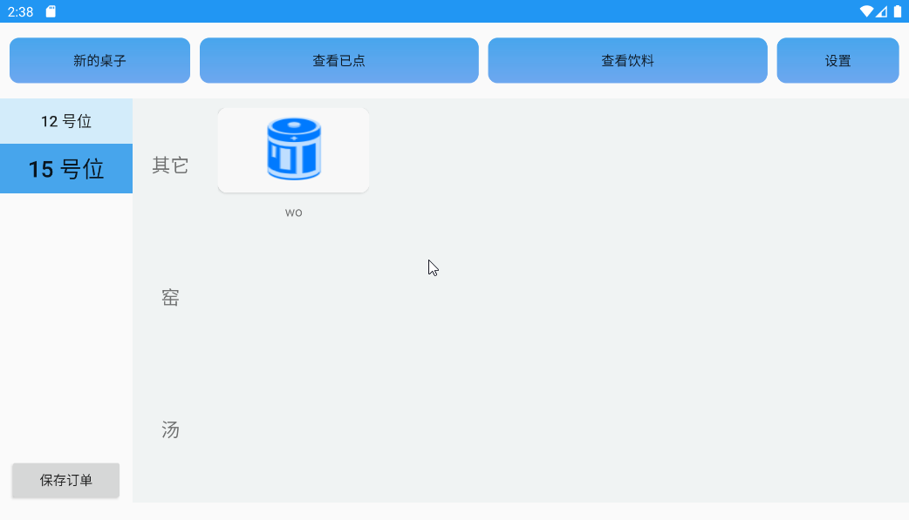
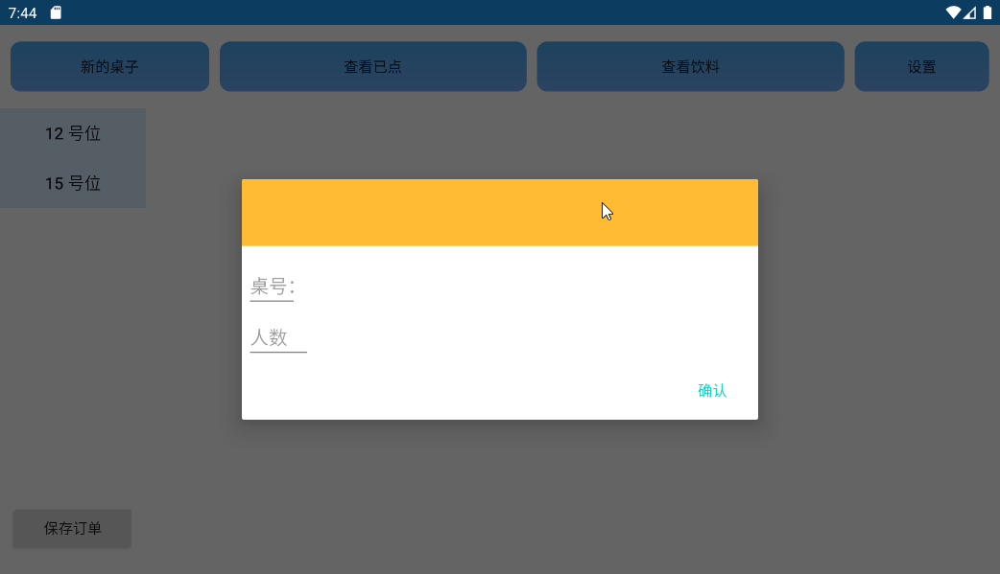
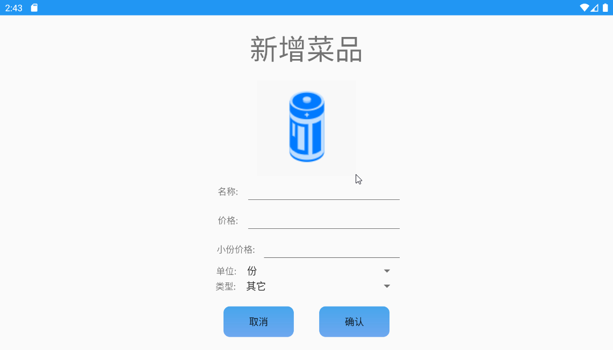
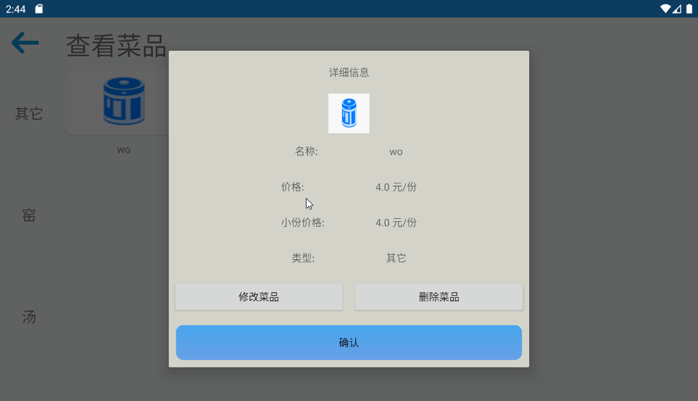
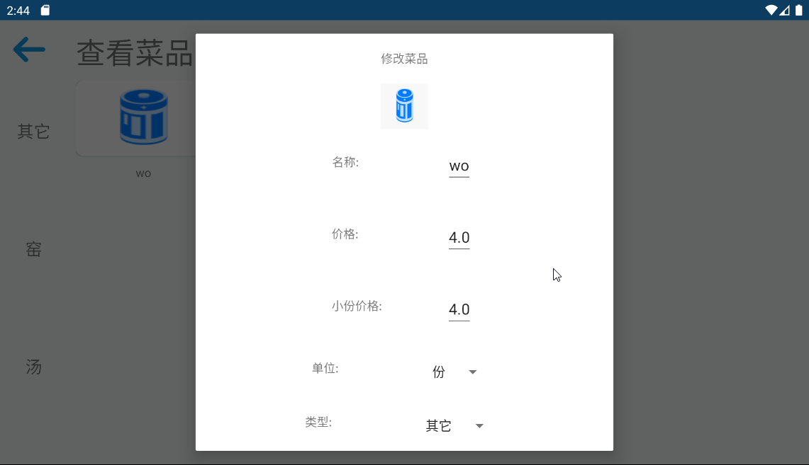
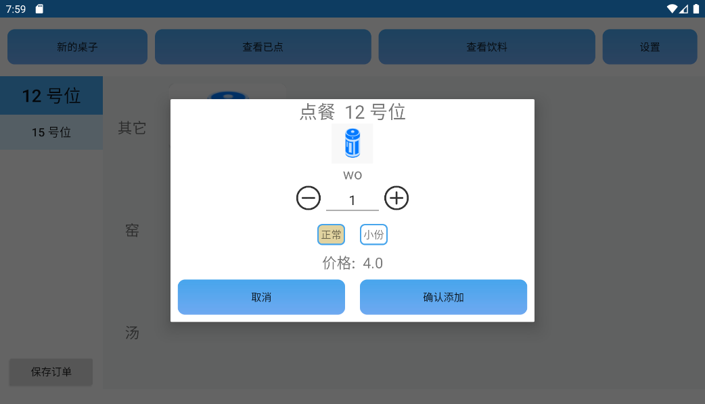
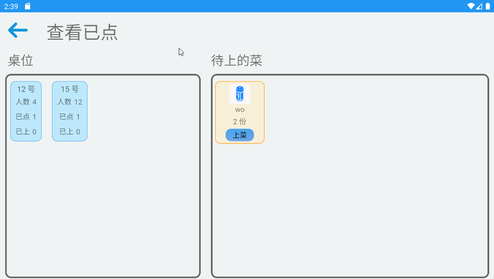
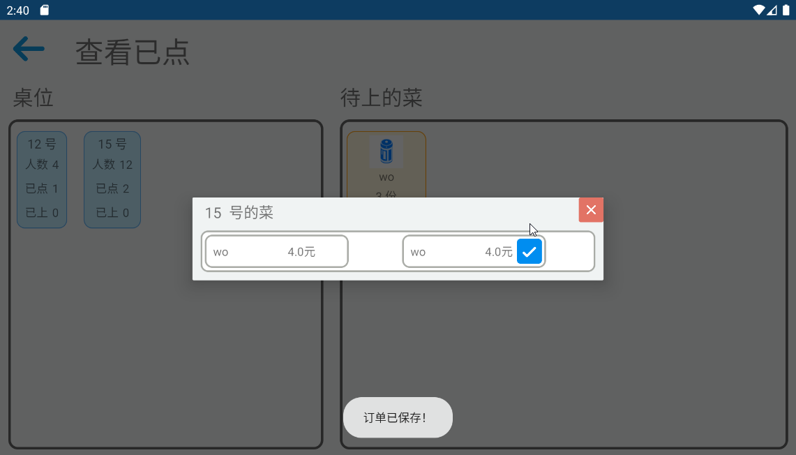
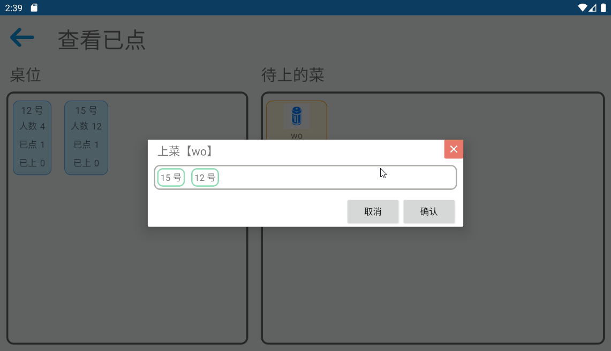
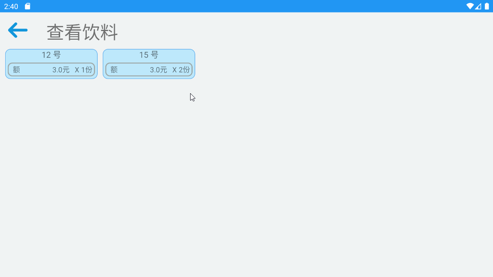

# CakeTouch
An App for increasing the the efficiency of order food and serve food.

Features:
- Add a table to order food.
- Order food in a dish panel, choose dish to order.
- Check all tables ordered.
- Check all foods ordered.
- Serve food in a 'ordered Food' panel.
- setting
  - Add a new dish.
  - Check the existing dish.

The technology include:

- SQLite operation.
- DialogFragment Extends.

一款为了提高点餐与上菜的效率的应用。

特征：
- 新建一个桌子以点餐。
- 在菜品面板中点餐选择菜品以点餐。
- 查看所有已点餐的桌子。
- 查看所有已点的食物。
- 在食物面板中点击食物进行上菜。
- 设置
  - 添加新菜品。
  - 查看已存在的菜品。

包含的技术：

- SQLite  操作。
- DialogFragment 继承。

快照:

 

